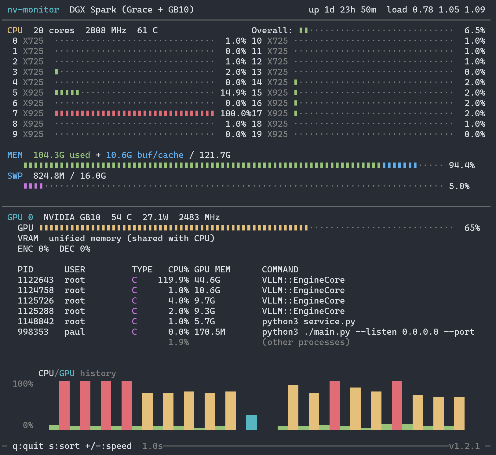

# nv-monitor

A lightweight terminal system monitor built for the **NVIDIA DGX Spark** (Grace CPU + GB10 GPU). Think htop + nvtop in a single 73KB binary.

  

## Display

### CPU Section
- **Overall** aggregate usage bar across all cores
- **Per-core** usage bars in dual-column layout with ARM core type labels (**X925** = performance cores at 3.9 GHz, **X725** = efficiency cores at 2.8 GHz on the Grace big.LITTLE architecture)
- CPU temperature (highest thermal zone) and frequency

### Memory Section
- **Used** (green) — actual application memory (total - free - buffers - cached)
- **Buf/cache** (blue) — kernel buffers and page cache (reclaimable)
- Swap usage bar
- Correctly handles **HugePages** on DGX Spark where `MemAvailable` is inaccurate

### GPU Section
- **GPU utilization** bar with temperature, power draw (watts), and clock speed
- **VRAM** bar, or "unified memory" label on DGX Spark where CPU/GPU share memory
- **ENC/DEC** — hardware video encoder (NVENC) and decoder (NVDEC) utilization percentage

### GPU Processes
- **PID** — process ID
- **USER** — process owner
- **TYPE** — **C** (Compute: CUDA/inference workloads) or **G** (Graphics: rendering, e.g. Xorg)
- **CPU%** — per-process CPU usage (delta-based, per-core scale)
- **GPU MEM** — GPU memory allocated by the process
- **COMMAND** — binary name with arguments
- **(other processes)** — summary row showing CPU usage from non-GPU processes

### History Chart
- Full-width rolling graph of CPU (green) and GPU (cyan) utilization over the last 20 samples using Unicode block elements (▁▂▃▄▅▆▇█)

### General
- Color-coded bars: green (normal), yellow (>60%), red (>90%)
- **CSV Logging** — log all stats to file with configurable interval
- **Headless Mode** — run without TUI for unattended data collection
- 1s default refresh, adjustable at runtime or via CLI
- NVML loaded dynamically at runtime — no hard dependency on NVIDIA drivers



## Download

For the reckless among you, there's a [binary release](https://github.com/wentbackward/nv-monitor/releases) you can download if you don't want to build it yourself.

## Building

Requires `gcc` and `libncurses-dev`:

```bash
sudo apt install build-essential libncurses-dev
make
```

## Usage

```bash
./nv-monitor                           # TUI only
./nv-monitor -l stats.csv              # TUI + log every 1s
./nv-monitor -l stats.csv -i 5000      # TUI + log every 5s
./nv-monitor -n -l stats.csv -i 500    # Headless, log every 500ms
./nv-monitor -r 2000                   # TUI refreshing every 2s
```

Or install system-wide:

```bash
sudo make install
```

### Command-line options

| Flag      | Description                          | Default |
|-----------|--------------------------------------|---------|
| `-l FILE` | Log statistics to CSV file           | off     |
| `-i MS`   | Log interval in milliseconds         | 1000    |
| `-n`      | Headless mode (no TUI, requires `-l`)| off     |
| `-r MS`   | UI refresh interval in milliseconds  | 1000    |
| `-v`      | Show version                         |         |
| `-h`      | Show help                            |         |

### Interactive controls

| Key     | Action                              |
|---------|-------------------------------------|
| `q`/Esc | Quit                                |
| `s`     | Toggle sort (GPU memory / PID)      |
| `+`/`-` | Adjust refresh rate (250ms steps)   |

## Requirements

- Linux (reads from `/proc` and `/sys`)
- ncurses
- NVIDIA drivers with NVML (for GPU monitoring — CPU/memory work without it)

Tested on DGX Spark (aarch64, CUDA 13.0, driver 580.x) but should work on any Linux system with an NVIDIA GPU.

## License

MIT
